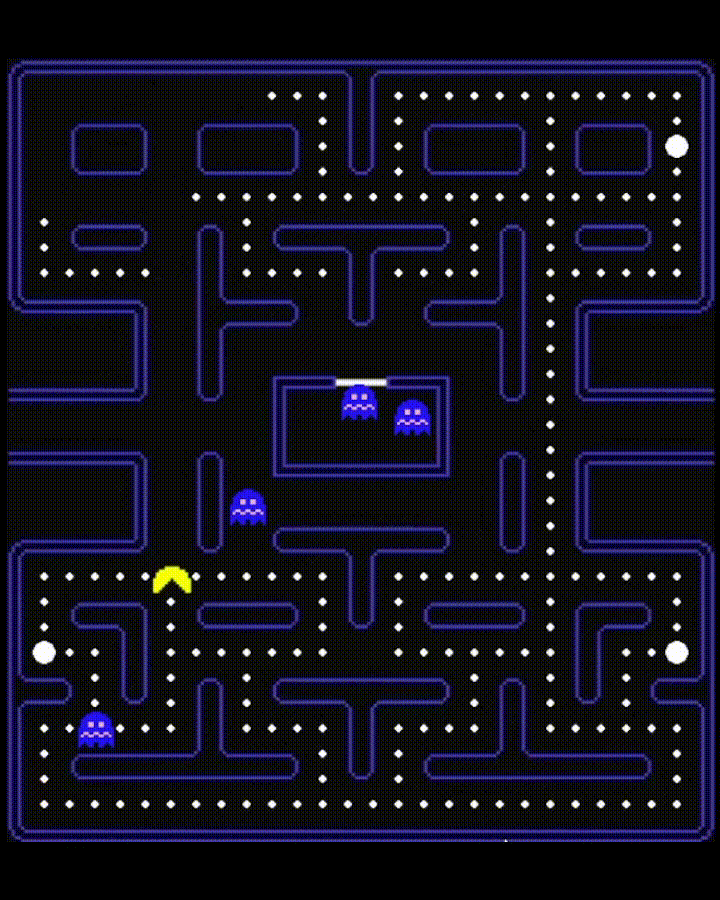

# Pacman_From_Scratch
An implementation of Pacman built from scratch in Python with heavy comments to make it easy to follow. The implementation 100% faithful to the quirky logic of the original arcade game.

To run the game, simply run the following commands in the terminal:

```
pip install pygame
python main.py
```

Then dig into main.py to see how it works!

